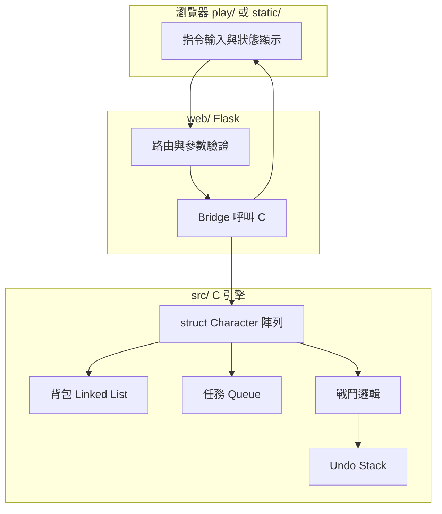
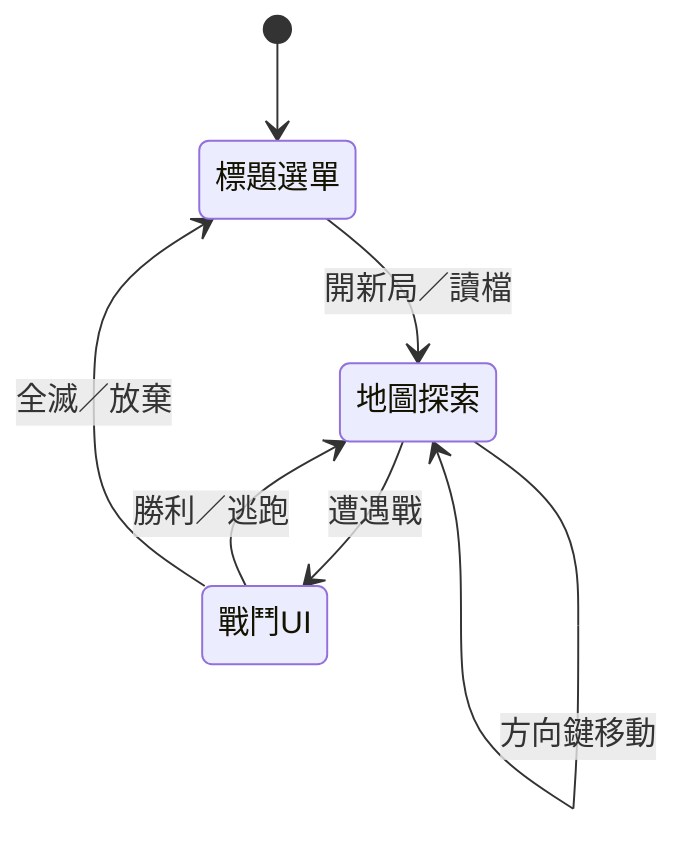

# RPG 系統（C × Flask × GitHub）

以 **C 語言** 實作核心遊戲引擎，透過 **Flask** 提供 Web 介面，並以 **GitHub** 管理版本與協作。本文件說明專案架構、目錄規範、**製作／安裝方式**與**遊玩規則**。

---

## 專案介紹

瀏覽器開啟 **`play/index.html`**（或經本機簡易 HTTP 伺服器）即可遊玩圖形介面版：邏輯在 `play/engine.js`，與 `src/` C 版規則對齊。**本機後端**：Flask 呼叫 `build/rpg_engine`；`static/` 為舊版表單式前端，可改指向 `play/`。

---

## 核心架構

### C 語言引擎

| 模組 | 資料結構 | 用途 |
|------|-----------|------|
| 角色 | `struct Character` | HP、MP、攻擊、防禦、等級、指向背包／任務狀態等 |
| 背包 | **Linked list** | 物品節點：名稱、數量、效果；支援新增／刪除／查詢 |
| 任務 | **Queue** | FIFO 事件排程（觸發順序、獎勵、逾時處理） |
| 戰鬥回溯 | **Stack** | 每回合快照或差分；`Undo` 彈出上一狀態還原 |

### 遊戲邏輯

- **戰鬥**：隨機或權重生成怪物；回合制（玩家行動 → 怪物行動）；傷害公式可含隨機區間與防禦減免。
- **任務**：將事件入隊；主迴圈或 Flask 每次請求時依序處理可觸發事件。
- **背包**：以鏈結串列維護道具；與戰鬥／商店互動時增刪節點並釋放 `malloc` 記憶體。

### Web 整合（Flask）

- 路由接收玩家指令（JSON 或表單）。
- 子程序呼叫 C 可執行檔，或以 **ctypes / Python C 擴充** 載入 `.so` / `.dll`。
- 回傳統一格式（建議 JSON）：角色狀態、戰鬥日誌、佇列中任務摘要、是否可 Undo。

---

## 功能亮點

| 類型 | 內容 |
|------|------|
| 基本 | 建立角色、探索地圖格、遭遇並戰鬥怪物 |
| 進階 | 背包（linked list）、任務排程（queue）、戰鬥 Undo（stack）、多角色（`struct Character` 陣列或動態配置） |

---

## GitHub 工程規範與目錄結構

建議目錄如下（可依實作微調，但維持職責分離）：

```text
RPG-Egine/
├── README.md
├── play/                     # 圖形介面遊戲（雙擊 index.html 或用本機伺服器開啟）
│   ├── index.html
│   ├── style.css
│   ├── engine.js
│   └── app.js
├── src/                      # C RPG 核心
│   ├── character.h / .c    # struct Character、多角色管理
│   ├── inventory.c           # 背包 linked list
│   ├── quest_queue.c         # 任務 queue
│   ├── battle.c              # 戰鬥 + stack undo
│   ├── map.c                 # 地圖／探索
│   └── main_cli.c          # 可選：純 C 除錯用 main
├── web/                      # Flask 後端
│   ├── requirements.txt      # 本機 pip：flask
│   ├── app.py
│   └── bridge.py             # 呼叫 C 可執行檔或載入 .so
├── static/                   # 前端（HTML/CSS/JS）
│   ├── index.html
│   └── app.js
├── Makefile 或 CMakeLists.txt
└── .gitignore                # 忽略 build/、__pycache__、.venv 等
```

**版本控制**：有意義的 commit 訊息、分支策略（例如 `main` 穩定、`dev` 開發）、必要時附簡短 PR 說明。

---

## 系統架構圖

以下為角色、任務、戰鬥與 Web 的關係（GitHub 上可顯示 Mermaid）：



---

## 使用技術

- **C**：指標（`struct`、鏈結節點）、`malloc` / `free`、模組化 `.c` / `.h`
- **資料結構**：linked list、queue、stack
- **Flask**：HTTP API、與 C 程序通訊
- **GitHub**：原始碼託管、Issues／Projects（可選）

---

## 前置需求（macOS / Windows）

依你要玩的版本選擇；**只玩圖形版** 與 **本機 Flask + C** 需求不同。

### 只玩瀏覽器圖形版（`play/`，建議）

| 項目 | macOS | Windows |
|------|--------|---------|
| 作業系統 | macOS 11+（建議 12+） | Windows 10 / 11（64 位元） |
| 瀏覽器 | Safari、Chrome、Edge、Firefox 近期版 | Chrome、Edge、Firefox 近期版 |
| 其它 | 無需安裝 C / Python | 無需安裝 C / Python |
| 可選 | 見下方「本機開啟網址」 | 同上，或安裝 [Python](https://www.python.org/downloads/) 勾選「Add to PATH」 |

進度存在瀏覽器 **localStorage**；換電腦或清除網站資料會消失。

### 本機 Flask + C 引擎（課程／對照用）

| 項目 | macOS | Windows |
|------|--------|---------|
| **C 編譯器** | Xcode Command Line Tools：`xcode-select --install`（內建 `clang`） | [MinGW-w64](https://www.mingw-w64.org/) 或 Visual Studio「使用 C++ 的桌面開發」取得 `gcc` |
| **Python** | 3.10+（可用 `brew install python` 或 [python.org](https://www.python.org/downloads/)） | 3.10+（安裝時勾選 **Add python.exe to PATH**） |
| **pip** | 隨 Python 安裝 | 隨 Python 安裝 |
| **Make** | 隨 Command Line Tools 提供 | 可用 `mingw32-make`，或於 Git Bash / WSL 內執行 `make` |
| **Git** | 可選（`xcode-select` 或 `brew install git`） | 可選（[Git for Windows](https://git-scm.com/download/win)） |

---

## 畫面需求（介面規格）

**原則：不以文字敘述推進遊戲。** 狀態與結果用圖示、血條、動畫、音效（可選）表達；引擎內部仍可保留 `message` 字串，但 `play/` **不顯示長句或任務說明文字**。

以下為專案應具備的**視覺與操作**目標，供實作 `play/` 或日後精靈圖版本時對照。

### 1. 地圖系統

| 需求 | 說明 |
|------|------|
| 背景地圖 | 探索模式顯示可辨識的**場景底圖**（瓦片圖、插畫或 CSS 場景），而非僅抽象按鈕。 |
| 角色可移動 | 玩家以**方向操作**改變地圖上的位置（見下節 sprite），座標與引擎 `map.x / map.y` 同步。 |
| 遭遇觸發 | 移動或踩格可觸發戰鬥、拾取、任務點等（邏輯仍由 `engine.js` / C 核心決定）。 |

**目前 `play/` 狀態**：**固定地圖**（開局生成後不變）、**地圖上固定魔物**、方向鍵移動；**⚔／空白／J** 對相鄰魔物開戰；HUD **⌂ 主頁**、**↻ 重新開始**。

### 2. 角色顯示（Sprite）

| 需求 | 說明 |
|------|------|
| 角色 Sprite | 地圖上顯示**角色圖像**（精靈圖或動畫幀），取代僅頭像圓圈。 |
| 四向移動 | 支援 **上／下／左／右** 移動；可依方向切換行走動畫（至少 4 方向靜態幀）。 |
| 操作方式 | 鍵盤方向鍵或 WASD；行動裝置可選虛擬方向鍵。 |

**目前 `play/` 狀態**：地圖上有 **簡易 sprite**（Canvas 繪製），支援 **方向鍵／虛擬方向鍵** 四向移動。

### 3. 戰鬥畫面（場景切換）

| 需求 | 說明 |
|------|------|
| 獨立戰鬥 UI | 進入戰鬥時**整頁或主舞台切換**為戰鬥版面，與探索地圖明確分離。 |
| 雙方呈現 | 顯示我方角色與敵方單位（圖像或大型立繪 + 狀態）。 |
| 指令區 | 攻擊、防禦、道具、逃跑、回溯等以**可點擊技能／道具區**呈現。 |

**目前 `play/` 狀態**：探索／戰鬥會**切換主舞台區塊**（VS 競技場 + 符印技能），已具備「另一套 UI」，但**非地圖上的即時戰鬥視角**。

### 4. 介面元素（常駐 HUD）

| 元素 | 說明 |
|------|------|
| 血量條（HP） | 角色與（戰鬥中）敵方皆需**可視化 HP 比例條**，數值可選顯示在條旁或 tooltip。 |
| 魔力條（MP） | 我方角色顯示 **MP 條**；技能若消耗 MP 需與條連動。 |
| 選單 | 提供**選單入口**（例如：背包、任務、隊伍切換、存檔／讀檔、設定）；可為側欄、底部列或暫停選單。 |

**目前 `play/` 狀態**：**HP／MP 條**、**☰ 選單**（圖示格）、道具藥水瓶、任務僅 **圓環進度 + 圖示**；事件回饋為 **畫面中央／目標處特效**，無文字 Toast。

### 畫面流程（建議）



### 建議資源目錄（日後擴充）

```text
play/assets/
├── maps/           # 地圖底圖、瓦片集
├── sprites/
│   ├── hero/       # 四向行走圖
│   └── monsters/   # 敵人圖
└── ui/             # 血條框、選單面板、按鈕
```

---

## 製作方式

### 瀏覽器圖形版（`play/`，免編譯）

1. 雙擊 **`play/index.html`**，或用本機 HTTP 伺服器（見下表）。
2. 進度儲存在瀏覽器 **localStorage**。

**本機開啟網址（依你在哪個資料夾執行 `python3 -m http.server`）：**

| 終端機目前目錄 | 指令 | 瀏覽器請開 |
|----------------|------|------------|
| 已在 **`play/`** 內 | `python3 -m http.server 8000` | **http://127.0.0.1:8000/** 或 **http://127.0.0.1:8000/index.html** |
| 在專案根目錄 **`RPG-Egine/`** | `python3 -m http.server 8000` | **http://127.0.0.1:8000/play/** |

若在 `play/` 裡卻開 `/play/` 會 **404**（伺服器根目錄就是 `play`，沒有再一層 `play` 資料夾）。

**macOS（在 `play/` 內，你目前的情況）：**

```bash
cd /path/to/RPG-Egine/play
python3 -m http.server 8000
# 開 http://127.0.0.1:8000/
```

**macOS（在專案根目錄）：**

```bash
cd /path/to/RPG-Egine
python3 -m http.server 8000
# 開 http://127.0.0.1:8000/play/
```

**Windows（PowerShell，在 `play` 內）：**

```powershell
cd C:\path\to\RPG-Egine\play
py -m http.server 8000
# 開 http://127.0.0.1:8000/
```

---

### 本機版：Flask + C 引擎

### 1. 建立虛擬環境並安裝 Flask

**macOS：**

```bash
cd /path/to/RPG-Egine
python3 -m venv .venv
source .venv/bin/activate
pip install -r web/requirements.txt
```

**Windows（PowerShell 或 CMD）：**

```powershell
cd C:\path\to\RPG-Egine
py -m venv .venv
.\.venv\Scripts\activate
pip install -r web/requirements.txt
```

### 2. 編譯 C 引擎

專案實作後，於專案根目錄執行（依你實際 Makefile 調整目標名稱）：

```bash
make                          # 或: cmake -B build && cmake --build build
```

產物範例：`build/rpg_engine`（可執行檔）或 `build/librpg.so`（供 ctypes 載入）。

### 3. 啟動 Flask

**macOS / Linux：**

```bash
export FLASK_APP=web.app
flask run --host 127.0.0.1 --port 5000
```

**Windows（PowerShell，venv 已啟用）：**

```powershell
$env:FLASK_APP = "web.app"
flask run --host 127.0.0.1 --port 5000
```

瀏覽器開啟 `http://127.0.0.1:5000`（若 `static/index.html` 由 Flask 提供）。

### 4. 開發建議流程

1. 先在 `src/` 完成純 C 邏輯（可用 `main_cli.c` 測試），確認無 memory leak（Valgrind 或 Xcode Instruments）。
2. 定義 **C 與 Python 之間的介面**（命令列參數、stdin/stdout JSON 行、或固定結構二進位）。
3. 在 `web/bridge.py` 封裝呼叫，再在 `app.py` 暴露 REST 路由。
4. `static/` 僅負責呈現與發送指令，不寫遊戲規則。

---

## 遊玩規則

以下為建議規則，實作時可寫死在 C 或以外部設定檔載入。

### 角色建立

- 玩家建立 1 名以上角色時，每名角色有獨立 **HP／MP／攻擊／防禦** 與**背包**。
- 初始數值可固定或依「職業模板」分配（戰士高防、法師高 MP 等）。

### 地圖與探索

- 地圖以格子表示；每次「探索」移動一格或隨機遭遇。
- 遭遇結果：**無事**、**戰鬥**、**寶箱**、**任務節點** 等，機率可設定表。

### 戰鬥（回合制）

1. 每回合玩家先選擇一項：**攻擊**、**防禦**（本回合減傷）、**使用道具**、**逃跑**（可設定成功率）。
2. 玩家行動後，若怪物仍存活，怪物執行攻擊（或 AI 行為）。
3. **傷害範例**：`damage = max(1, attacker_ATK - defender_DEF + random(0, N))`（實際公式以程式為準）。
4. HP 歸零的一方敗北；擊敗怪物可獲得經驗、金幣或道具入背包。

### 背包與道具

- 道具為鏈結串列節點；使用消耗品後刪除節點並 `free`。
- 可設定**背包容量**或**重量上限**；超過時無法拾取或需丟棄。

### 任務（Queue）

- 新任務從**隊尾**入隊；系統依序從**隊頭**檢查是否滿足觸發條件（擊殺數、到達座標等）。
- 完成任務後出隊並發放獎勵；逾時任務可標記失敗或重新排程（依設計）。

### 戰鬥回溯（Undo）

- 每回合開始前將「可還原狀態」**壓入 stack**（例如雙方 HP、回合數、關鍵 buff）。
- 玩家選擇 **Undo** 時**彈出**上一狀態還原；可限制每場戰鬥次數，避免無限回溯。
- **注意**：若與「隨機種子」有關，需決定 Undo 後是否重骰或還原隨機序列（建議還原快照以保持一致）。

### 勝負與存檔

- 主線目標達成（例如擊敗 Boss 或完成任務鏈）即勝利。
- 存檔可序列化角色陣列、背包、任務隊列至檔案；讀檔時重建 linked list 與 queue。

---

## 授權與貢獻

於專案根目錄加入 `LICENSE`（例如 MIT）；貢獻流程可於本 README 補充「如何提 PR」與程式風格說明。

---

## 相關檔案索引

| 主題 | 本 README 章節 |
|------|----------------|
| 架構與資料結構 | [核心架構](#核心架構)、[系統架構圖](#系統架構圖) |
| 目錄與 GitHub 規範 | [GitHub 工程規範與目錄結構](#github-工程規範與目錄結構) |
| 前置需求（mac / Win） | [前置需求](#前置需求macos--windows) |
| 畫面與 UI 規格 | [畫面需求](#畫面需求介面規格) |
| 環境與編譯執行 | [製作方式](#製作方式) |
| 遊戲流程與限制 | [遊玩規則](#遊玩規則) |
