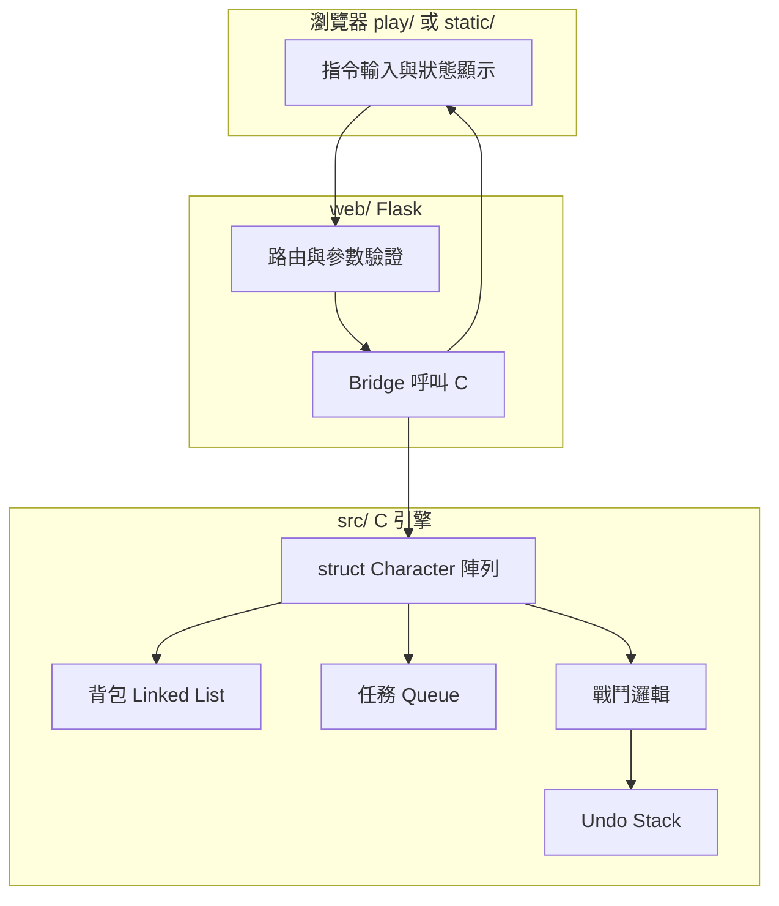

# RPG 系統（C × Flask × GitHub）

以 **C 語言** 實作核心遊戲引擎，透過 **Flask** 提供 Web 介面，並以 **GitHub** 管理版本與協作。本文件說明專案架構、目錄規範、**製作／安裝方式**與**遊玩規則**。

---

## 專案介紹

瀏覽器輸入指令（攻擊、防禦、使用道具等）。**線上**：`play/` 內建與 C 版對齊的遊戲邏輯，可部署到 **Vercel** 靜態託管，開網址即可遊玩（無需 Python／編譯 C）。**本機**：Flask 呼叫 `build/rpg_engine`，回傳 JSON 狀態；`static/` 為舊版 Flask 用前端。

---

## 核心架構

### C 語言引擎

| 模組 | 資料結構 | 用途 |
|------|-----------|------|
| 角色 | `struct Character` | HP、MP、攻擊、防禦、等級、指向背包／任務狀態等 |
| 背包 | **Linked list** | 物品節點：名稱、數量、效果；支援新增／刪除／查詢 |
| 任務 | **Queue** | FIFO 事件排程（觸發順序、獎勵、逾時處理） |
| 戰鬥回溯 | **Stack** | 每回合快照或差分；`Undo` 彈出上一狀態還原 |

### 遊戲邏輯

- **戰鬥**：隨機或權重生成怪物；回合制（玩家行動 → 怪物行動）；傷害公式可含隨機區間與防禦減免。
- **任務**：將事件入隊；主迴圈或 Flask 每次請求時依序處理可觸發事件。
- **背包**：以鏈結串列維護道具；與戰鬥／商店互動時增刪節點並釋放 `malloc` 記憶體。

### Web 整合（Flask）

- 路由接收玩家指令（JSON 或表單）。
- 子程序呼叫 C 可執行檔，或以 **ctypes / Python C 擴充** 載入 `.so` / `.dll`。
- 回傳統一格式（建議 JSON）：角色狀態、戰鬥日誌、佇列中任務摘要、是否可 Undo。

---

## 功能亮點

| 類型 | 內容 |
|------|------|
| 基本 | 建立角色、探索地圖格、遭遇並戰鬥怪物 |
| 進階 | 背包（linked list）、任務排程（queue）、戰鬥 Undo（stack）、多角色（`struct Character` 陣列或動態配置） |

---

## GitHub 工程規範與目錄結構

建議目錄如下（可依實作微調，但維持職責分離）：

```text
RPG-Egine/
├── README.md
├── vercel.json               # Vercel：建置後輸出 dist/（由 play/ 複製）
├── package.json              # npm run vercel-build
├── play/                     # 瀏覽器版（Vercel 靜態託管，開網址即玩）
│   ├── index.html
│   ├── style.css
│   ├── engine.js
│   └── app.js
├── src/                      # C RPG 核心（本機 / 課程用）
│   ├── character.h / .c    # struct Character、多角色管理
│   ├── inventory.c           # 背包 linked list
│   ├── quest_queue.c         # 任務 queue
│   ├── battle.c              # 戰鬥 + stack undo
│   ├── map.c                 # 地圖／探索
│   └── main_cli.c          # 可選：純 C 除錯用 main
├── web/                      # Flask 後端
│   ├── app.py
│   └── bridge.py             # 呼叫 C 可執行檔或載入 .so
├── static/                   # 前端（HTML/CSS/JS）
│   ├── index.html
│   └── app.js
├── Makefile 或 CMakeLists.txt
└── .gitignore                # 忽略 build/、__pycache__、.venv 等
```

**版本控制**：有意義的 commit 訊息、分支策略（例如 `main` 穩定、`dev` 開發）、必要時附簡短 PR 說明。

---

## 系統架構圖

以下為角色、任務、戰鬥與 Web 的關係（GitHub 上可顯示 Mermaid）：



---

## 使用技術

- **C**：指標（`struct`、鏈結節點）、`malloc` / `free`、模組化 `.c` / `.h`
- **資料結構**：linked list、queue、stack
- **Flask**：HTTP API、與 C 程序通訊
- **GitHub**：原始碼託管、Issues／Projects（可選）

---

## 製作方式

### 線上版：Vercel（免本機 Python／C）

1. 將專案推上 GitHub。
2. 在 [Vercel](https://vercel.com) 建立新專案並 Import 此 repo（**Root Directory 使用儲存庫根目錄**）。
3. 建置會執行 `npm run vercel-build`：把 `play/` 複製到 `dist/` 後作為靜態網站發佈（見根目錄 `vercel.json`）。
4. 部署完成後，開啟 Vercel 提供的網址即可遊玩。進度存在瀏覽器 **localStorage**（僅該瀏覽器本機；換裝置或清除網站資料會消失）。

---

### 本機版：Flask + C 引擎

#### 前置需求

- **C 編譯器**：GCC 或 Clang（macOS 通常已具備 `clang`）
- **Python 3.10+** 與 **pip**
- **Git**

### 1. 建立虛擬環境並安裝 Flask

```bash
cd /path/to/RPG-Egine
python3 -m venv .venv
source .venv/bin/activate   # Windows: .venv\Scripts\activate
pip install flask
```

### 2. 編譯 C 引擎

專案實作後，於專案根目錄執行（依你實際 Makefile 調整目標名稱）：

```bash
make                          # 或: cmake -B build && cmake --build build
```

產物範例：`build/rpg_engine`（可執行檔）或 `build/librpg.so`（供 ctypes 載入）。

### 3. 啟動 Flask

```bash
export FLASK_APP=web.app      # 依實際模組路徑調整
flask run --host 127.0.0.1 --port 5000
```

瀏覽器開啟 `http://127.0.0.1:5000`（若 `static/index.html` 由 Flask 提供）。

### 4. 開發建議流程

1. 先在 `src/` 完成純 C 邏輯（可用 `main_cli.c` 測試），確認無 memory leak（Valgrind 或 Xcode Instruments）。
2. 定義 **C 與 Python 之間的介面**（命令列參數、stdin/stdout JSON 行、或固定結構二進位）。
3. 在 `web/bridge.py` 封裝呼叫，再在 `app.py` 暴露 REST 路由。
4. `static/` 僅負責呈現與發送指令，不寫遊戲規則。

---

## 遊玩規則

以下為建議規則，實作時可寫死在 C 或以外部設定檔載入。

### 角色建立

- 玩家建立 1 名以上角色時，每名角色有獨立 **HP／MP／攻擊／防禦** 與**背包**。
- 初始數值可固定或依「職業模板」分配（戰士高防、法師高 MP 等）。

### 地圖與探索

- 地圖以格子表示；每次「探索」移動一格或隨機遭遇。
- 遭遇結果：**無事**、**戰鬥**、**寶箱**、**任務節點** 等，機率可設定表。

### 戰鬥（回合制）

1. 每回合玩家先選擇一項：**攻擊**、**防禦**（本回合減傷）、**使用道具**、**逃跑**（可設定成功率）。
2. 玩家行動後，若怪物仍存活，怪物執行攻擊（或 AI 行為）。
3. **傷害範例**：`damage = max(1, attacker_ATK - defender_DEF + random(0, N))`（實際公式以程式為準）。
4. HP 歸零的一方敗北；擊敗怪物可獲得經驗、金幣或道具入背包。

### 背包與道具

- 道具為鏈結串列節點；使用消耗品後刪除節點並 `free`。
- 可設定**背包容量**或**重量上限**；超過時無法拾取或需丟棄。

### 任務（Queue）

- 新任務從**隊尾**入隊；系統依序從**隊頭**檢查是否滿足觸發條件（擊殺數、到達座標等）。
- 完成任務後出隊並發放獎勵；逾時任務可標記失敗或重新排程（依設計）。

### 戰鬥回溯（Undo）

- 每回合開始前將「可還原狀態」**壓入 stack**（例如雙方 HP、回合數、關鍵 buff）。
- 玩家選擇 **Undo** 時**彈出**上一狀態還原；可限制每場戰鬥次數，避免無限回溯。
- **注意**：若與「隨機種子」有關，需決定 Undo 後是否重骰或還原隨機序列（建議還原快照以保持一致）。

### 勝負與存檔

- 主線目標達成（例如擊敗 Boss 或完成任務鏈）即勝利。
- 存檔可序列化角色陣列、背包、任務隊列至檔案；讀檔時重建 linked list 與 queue。

---

## 授權與貢獻

於專案根目錄加入 `LICENSE`（例如 MIT）；貢獻流程可於本 README 補充「如何提 PR」與程式風格說明。

---

## 相關檔案索引

| 主題 | 本 README 章節 |
|------|----------------|
| 架構與資料結構 | [核心架構](#核心架構)、[系統架構圖](#系統架構圖) |
| 目錄與 GitHub 規範 | [GitHub 工程規範與目錄結構](#github-工程規範與目錄結構) |
| 環境與編譯執行 | [製作方式](#製作方式) |
| 遊戲流程與限制 | [遊玩規則](#遊玩規則) |
