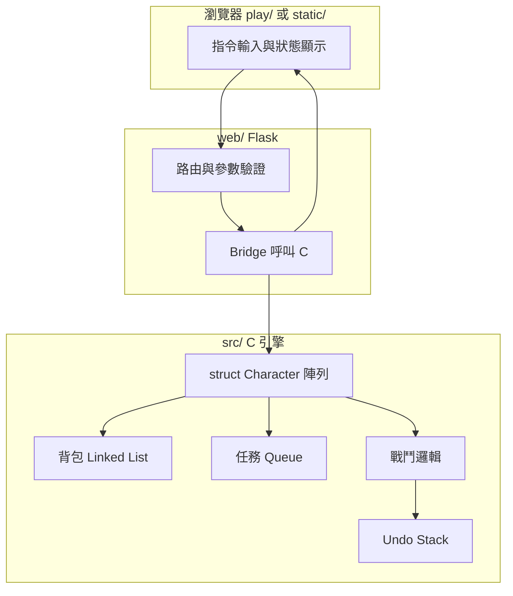
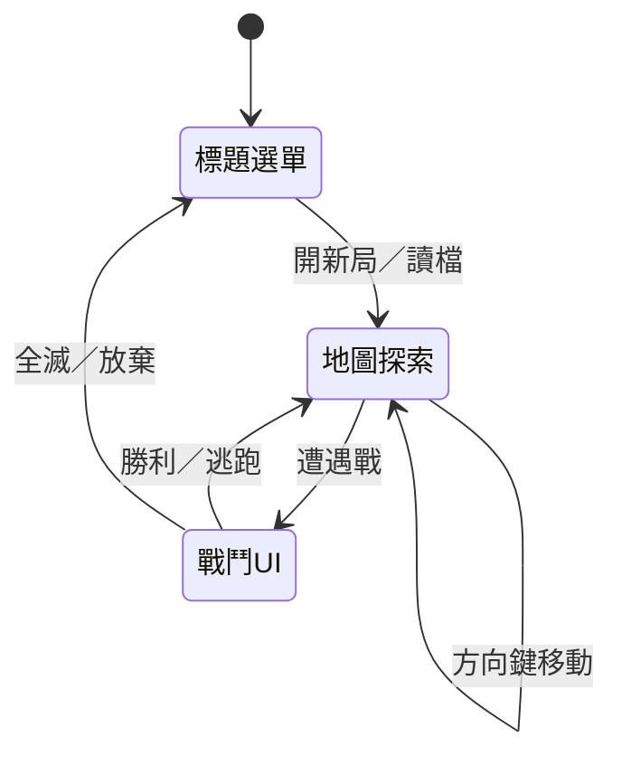

# RPG 系統（C × Flask × GitHub）

以 **C 語言** 實作核心遊戲引擎，透過 **Flask** 提供 Web 介面，並以 **GitHub** 管理版本與協作。本文件說明專案架構、目錄規範、**製作／安裝方式**與**遊玩規則**。

---

## 專案介紹

瀏覽器經本機 **HTTP 伺服器**（需先安裝 **Python 3**）開啟 **`play/`** 即可遊玩圖形介面版；邏輯在 `play/engine.js`，與 `src/` C 版規則對齊。**本機後端**：Flask 亦需 Python，呼叫 `build/rpg_engine`；`static/` 為舊版表單式前端，可改指向 `play/`。

---

## 核心架構

### C 語言引擎

| 模組 | 資料結構 | 用途 |
|------|-----------|------|
| 角色 | `struct Character` | HP、MP、攻擊、防禦、等級、指向背包／任務狀態等 |
| 背包 | **Linked list** | 物品節點：名稱、數量、效果；支援新增／刪除／查詢 |
| 任務 | **Queue** | FIFO 事件排程（觸發順序、獎勵、逾時處理） |
| 戰鬥回溯 | **Stack** | 每回合快照或差分；`Undo` 彈出上一狀態還原 |

### 遊戲邏輯

- **戰鬥**：隨機或權重生成怪物；回合制（玩家行動 → 怪物行動）；傷害公式可含隨機區間與防禦減免。
- **任務**：將事件入隊；主迴圈或 Flask 每次請求時依序處理可觸發事件。
- **背包**：以鏈結串列維護道具；與戰鬥／商店互動時增刪節點並釋放 `malloc` 記憶體。

### Web 整合（Flask）

- 路由接收玩家指令（JSON 或表單）。
- 子程序呼叫 C 可執行檔，或以 **ctypes / Python C 擴充** 載入 `.so` / `.dll`。
- 回傳統一格式（建議 JSON）：角色狀態、戰鬥日誌、佇列中任務摘要、是否可 Undo。

---

## 功能亮點

| 類型 | 內容 |
|------|------|
| 基本 | 建立角色、探索地圖格、遭遇並戰鬥怪物 |
| 進階 | 背包（linked list）、任務排程（queue）、戰鬥 Undo（stack）、多角色（`struct Character` 陣列或動態配置） |

---

## GitHub 工程規範與目錄結構

建議目錄如下（可依實作微調，但維持職責分離）：

```text
RPG-Egine/
├── README.md
├── play/                     # 圖形介面遊戲（雙擊 index.html 或用本機伺服器開啟）
│   ├── index.html
│   ├── style.css
│   ├── stories.js            # 各職業故事與任務
│   ├── items.js              # 道具定義
│   ├── world.js              # 2D 地圖繪製
│   ├── engine.js
│   └── app.js
├── src/                      # C RPG 核心
│   ├── character.h / .c    # struct Character、多角色管理
│   ├── inventory.c           # 背包 linked list
│   ├── quest_queue.c         # 任務 queue
│   ├── battle.c              # 戰鬥 + stack undo
│   ├── map.c                 # 地圖／探索
│   └── main_cli.c          # 可選：純 C 除錯用 main
├── web/                      # Flask 後端
│   ├── requirements.txt      # 本機 pip：flask
│   ├── app.py
│   └── bridge.py             # 呼叫 C 可執行檔或載入 .so
├── static/                   # 前端（HTML/CSS/JS）
│   ├── index.html
│   └── app.js
├── Makefile 或 CMakeLists.txt
└── .gitignore                # 忽略 build/、__pycache__、.venv 等
```

**版本控制**：有意義的 commit 訊息、分支策略（例如 `main` 穩定、`dev` 開發）、必要時附簡短 PR 說明。

---

## 系統架構圖

以下為角色、任務、戰鬥與 Web 的關係（GitHub 上可顯示 Mermaid）：


```mermaid
flowchart TB
  subgraph Browser["瀏覽器 play/ 或 static/"]
    UI[指令輸入與狀態顯示]
  end
  subgraph Flask["web/ Flask"]
    API[路由與參數驗證]
    BR[Bridge 呼叫 C]
  end
  subgraph CEngine["src/ C 引擎"]
    CH[struct Character 陣列]
    INV[背包 Linked List]
    Q[任務 Queue]
    BT[戰鬥邏輯]
    ST[Undo Stack]
  end
  UI --> API
  API --> BR
  BR --> CH
  CH --> INV
  CH --> Q
  CH --> BT
  BT --> ST
  BR --> UI
```

---

## 使用技術

- **C**：指標（`struct`、鏈結節點）、`malloc` / `free`、模組化 `.c` / `.h`
- **資料結構**：linked list、queue、stack
- **Flask**：HTTP API、與 C 程序通訊
- **GitHub**：原始碼託管、Issues／Projects（可選）

---

## 前置需求（macOS / Windows）

依你要玩的版本選擇；**只玩圖形版** 與 **本機 Flask + C** 需求不同。

### 只玩瀏覽器圖形版（`play/`，建議）

| 項目 | macOS | Windows |
|------|--------|---------|
| 作業系統 | macOS 11+（建議 12+） | Windows 10 / 11（64 位元） |
| 瀏覽器 | Safari、Chrome、Edge、Firefox 近期版 | Chrome、Edge、Firefox 近期版 |
| **Python 3** | **必裝**（見下方安裝說明） | **必裝**（安裝時勾選 **Add python.exe to PATH**） |
| 其它 | 無需安裝 C / Flask | 無需安裝 C / Flask |

使用 `python3 -m http.server` 啟動本機伺服器時，系統必須已安裝 Python；若終端出現 `command not found: python3` 或 `'python3' 不是內部或外部命令`，請先完成安裝再執行下方指令。

進度存在瀏覽器 **localStorage**；換電腦或清除網站資料會消失。

### 鍵盤操作（`play/` 圖形版）

遊戲中**僅支援鍵盤**，畫面上不再顯示虛擬方向鍵或攻擊按鈕，避免遮擋地圖。

| 按鍵 | 功能 |
|------|------|
| **↑ ↓ ← →** 或 **W A S D** | 在地圖上四向移動 |
| **Space**（空白鍵） | **普攻**（各職業近戰／遠程不同，見下表） |
| **1 / 2** | **技能 1 / 技能 2**（耗 MP，左側英雄面板也可點擊） |
| **B** | 切換至 **背包** 面板，點擊道具使用 |
| **Q** | 切換至 **任務** 面板 |

**關卡制（共 4 關）：** 每關 **8 隻**魔物 + 中央**首領**。通關順序與地圖主題：**草原 → 雪原 → 熔岩 → 水晶**；魔物會隨**關卡與英雄等級**略為變強（中等難度）。第 4 關首領擊敗即**全劇通關**。

**各職業戰鬥方式：**

| 職業 | 普攻 | 技能 1 | 技能 2 |
|------|------|--------|--------|
| 戰士 | 近戰重劈 | 衝鋒斬（2 格） | 盾牆（提升防禦） |
| 法師 | 遠程魔彈（3 格） | 火球術（4 格） | 冰霜環（範圍傷害） |
| 牧師 | 近戰聖擊＋自癒 | 治療術 | 審判光（遠程 3 格） |
| 盜賊 | 近戰暗襲（暴擊） | 毒刃 | 飛刀（遠程 3 格） |

遠程攻擊會優先打**面向方向**上的敵人；地圖上會顯示飛彈／斬擊等特效。

**魔物種類：** 每關僅出現該關專屬魔物（含關卡限定造型）。例如草原：史萊姆／哥布林／花蔓妖；雪原：霜雪人／凍骨士兵；熔岩：火焰小鬼／炎獸人；水晶：水晶碎靈／晶化史萊姆。首領亦隨關卡變化；**等級越高，小怪與首領的血量／攻擊／防禦也會略升**。

**首領掉落：** 擊敗關底首領會自動獲得該關獎勵道具（地圖上顯示掉落特效、訊息列顯示「首領掉落：…」），並有機率額外獲得藥草。各關獎勵大致為：草原（治療藥水、藥草）→ 雪原（強效藥水、魔力藥水）→ 熔岩（強效藥水、乙醚）→ 水晶（強效＋魔力藥水、乙醚）。

**任務模式：** 每職業 **8 條**連續任務（討伐／通關／首領／等級／技能），完成後自動領獎並解鎖下一條；按 **Q** 查看任務日誌。

**介面按鈕（滑鼠，非地圖操控）：**

| 按鈕 | 功能 |
|------|------|
| **主選單** | 返回選角畫面（會先自動存檔） |
| **重新開始** | 清除本局進度並以目前選擇的職業重新開始 |
| **任務 / 背包**（頂部） | 與 **Q / B** 相同，切換左側任務或背包 |

**開局：** 選擇一個職業（戰士 / 法師 / 牧師 / 盜賊）→ **新遊戲** 或 **繼續遊戲** 讀檔。

**提示：** 若畫面沒有地圖，請用 **Cmd+Shift+R**（Windows：**Ctrl+Shift+R**）強制重新整理；建議先 **清除存檔** 再 **新遊戲**。

### 本機 Flask + C 引擎（課程／對照用）

| 項目 | macOS | Windows |
|------|--------|---------|
| **C 編譯器** | Xcode Command Line Tools：`xcode-select --install`（內建 `clang`） | [MinGW-w64](https://www.mingw-w64.org/) 或 Visual Studio「使用 C++ 的桌面開發」取得 `gcc` |
| **Python** | 3.10+（可用 `brew install python` 或 [python.org](https://www.python.org/downloads/)） | 3.10+（安裝時勾選 **Add python.exe to PATH**） |
| **pip** | 隨 Python 安裝 | 隨 Python 安裝 |
| **Make** | 隨 Command Line Tools 提供 | 可用 `mingw32-make`，或於 Git Bash / WSL 內執行 `make` |
| **Git** | 可選（`xcode-select` 或 `brew install git`） | 可選（[Git for Windows](https://git-scm.com/download/win)） |

---

## 畫面需求（介面規格）

**原則：不以文字敘述推進遊戲。** 狀態與結果用圖示、血條、動畫、音效（可選）表達；引擎內部仍可保留 `message` 字串，但 `play/` **不顯示長句或任務說明文字**。

以下為專案應具備的**視覺與操作**目標，供實作 `play/` 或日後精靈圖版本時對照。

### 1. 地圖系統

| 需求 | 說明 |
|------|------|
| 背景地圖 | 探索模式顯示可辨識的**場景底圖**（瓦片圖、插畫或 CSS 場景），而非僅抽象按鈕。 |
| 角色可移動 | 玩家以**方向操作**改變地圖上的位置（見下節 sprite），座標與引擎 `map.x / map.y` 同步。 |
| 遭遇觸發 | 移動或踩格可觸發戰鬥、拾取、任務點等（邏輯仍由 `engine.js` / C 核心決定）。 |

**目前 `play/` 狀態**：**固定 2D 地圖**、**4 關**制（草原／雪原／熔岩／水晶造景）、每關含**主題河流、村莊、橋與大量造景**、8 隻小怪 + 首領、**鍵盤**操作；全中文 HUD。

**各關怪物（專屬名稱與像素造型）**

| 關卡 | 地圖 | 小怪（每關 4 種隨機） | 關底首領 |
|------|------|------------------------|----------|
| 1 | 草原 | 草原史萊姆、野草哥布林、疾風野狼、花蔓妖 | 草原巨獸（強化野狼造型） |
| 2 | 雪原 | 冰霜蝙蝠、凍骨士兵、雪原狼、霜雪人 | 雪原霸主（霜雪人造型） |
| 3 | 熔岩 | 熔岩蜘蛛、炎獸人、焦土石像、火焰小鬼 | 熔岩領主（火焰小鬼造型） |
| 4 | 水晶 | 晶化史萊姆、棱光蝙蝠、晶網蜘蛛、水晶碎靈 | 水晶龍王（水晶碎靈造型） |

花蔓妖、霜雪人、火焰小鬼、古代幽靈、水晶碎靈為**關卡限定**新造型；其餘種類會依關卡套用不同中文名稱與血條配色。請**強制重新整理**或**清除存檔後新遊戲**以載入最新腳本。

### 2. 角色顯示（Sprite）

| 需求 | 說明 |
|------|------|
| 角色 Sprite | 地圖上顯示**角色圖像**（精靈圖或動畫幀），取代僅頭像圓圈。 |
| 四向移動 | 支援 **上／下／左／右** 移動；可依方向切換行走動畫（至少 4 方向靜態幀）。 |
| 操作方式 | 鍵盤方向鍵或 WASD（見「鍵盤操作」一節）。 |

**目前 `play/` 狀態**：地圖上有 **HD-2D 風格像素 sprite**（Canvas 繪製），四職業不同造型；**僅鍵盤**四向移動。

### 3. 戰鬥畫面（場景切換）

| 需求 | 說明 |
|------|------|
| 獨立戰鬥 UI | 進入戰鬥時**整頁或主舞台切換**為戰鬥版面，與探索地圖明確分離。 |
| 雙方呈現 | 顯示我方角色與敵方單位（圖像或大型立繪 + 狀態）。 |
| 指令區 | 攻擊、防禦、道具、逃跑、回溯等以**可點擊技能／道具區**呈現。 |

**目前 `play/` 狀態**：**地圖上即時戰鬥**（不切換戰鬥畫面）；攻擊後雙方血條在原地更新，怪物死亡後消失。

### 4. 介面元素（常駐 HUD）

| 元素 | 說明 |
|------|------|
| 血量條（HP） | 角色與（戰鬥中）敵方皆需**可視化 HP 比例條**，數值可選顯示在條旁或 tooltip。 |
| 魔力條（MP） | 我方角色顯示 **MP 條**；技能若消耗 MP 需與條連動。 |
| 選單 | 提供**選單入口**（例如：背包、任務、隊伍切換、存檔／讀檔、設定）；可為側欄、底部列或暫停選單。 |

**目前 `play/` 狀態**：**生命／魔力條**、左側 **故事 / 任務 / 背包 / 英雄**（含關卡與招式說明）、任務進度條與獎勵說明；背包點擊使用道具；擊敗小怪有機率掉落 **藥草**。

### 畫面流程（建議）


```mermaid
stateDiagram-v2
  [*] --> 標題選單
  標題選單 --> 地圖探索: 開新局／讀檔
  地圖探索 --> 地圖探索: 方向鍵移動
  地圖探索 --> 戰鬥UI: 遭遇戰
  戰鬥UI --> 地圖探索: 勝利／逃跑
  戰鬥UI --> 標題選單: 全滅／放棄
```

### 建議資源目錄（日後擴充）

```text
play/assets/
├── maps/           # 地圖底圖、瓦片集
├── sprites/
│   ├── hero/       # 四向行走圖
│   └── monsters/   # 敵人圖
└── ui/             # 血條框、選單面板、按鈕
```

---

## 製作方式

### 瀏覽器圖形版（`play/`，免編譯）

1. **安裝 Python 3**（若尚未安裝，見下一小節）。
2. 在終端機執行 **`python3 -m http.server`**（見下表），再用瀏覽器開啟對應網址。
3. 進度儲存在瀏覽器 **localStorage**。
4. 操作方式見上文 **「鍵盤操作（`play/` 圖形版）」**。

> **為什麼要裝 Python？**  
> `play/` 內有多個 `.js` 腳本，用 `file://` 直接雙擊 `index.html` 時，部分瀏覽器會擋下載入而導致地圖無法顯示。用 Python 內建的簡易 HTTP 伺服器是最省事、也最穩定的開法。

#### 安裝 Python 3

| 系統 | 安裝方式 | 安裝後確認 |
|------|----------|------------|
| **macOS** | [python.org 下載](https://www.python.org/downloads/) 安裝，或終端執行 `brew install python`（需已安裝 [Homebrew](https://brew.sh/)） | `python3 --version` 應顯示 3.10 或以上 |
| **Windows** | [python.org 下載](https://www.python.org/downloads/) 安裝程式，**務必勾選**「Add python.exe to PATH」 | `py --version` 或 `python --version` |

安裝完成後，在專案資料夾開啟終端機（macOS：終端機；Windows：PowerShell 或「命令提示字元」），再執行下方的 `python3 -m http.server`（Windows 可改為 `py -m http.server`）。

**本機開啟網址（依你在哪個資料夾執行 `python3 -m http.server`）：**

| 終端機目前目錄 | 指令 | 瀏覽器請開 |
|----------------|------|------------|
| 已在 **`play/`** 內 | `python3 -m http.server 8000` | **http://127.0.0.1:8000/** 或 **http://127.0.0.1:8000/index.html** |
| 在專案根目錄 **`RPG-Egine/`** | `python3 -m http.server 8000` | **http://127.0.0.1:8000/play/** |

若在 `play/` 裡卻開 `/play/` 會 **404**（伺服器根目錄就是 `play`，沒有再一層 `play` 資料夾）。

**macOS（在 `play/` 內）：**

```bash
cd /path/to/RPG-Egine/play
python3 -m http.server 8000
```

瀏覽器開啟：**http://127.0.0.1:8000/**

**macOS（在專案根目錄 `RPG-Egine/`）：**

```bash
cd /path/to/RPG-Egine
python3 -m http.server 8000
```

瀏覽器開啟：**http://127.0.0.1:8000/play/**

**Windows（PowerShell，在 `play` 內）：**

```powershell
cd C:\path\to\RPG-Egine\play
py -m http.server 8000
```

若 `py` 無法使用，可改試 `python -m http.server 8000`。瀏覽器開啟：**http://127.0.0.1:8000/**

**常見問題**

| 狀況 | 處理方式 |
|------|----------|
| `python3: command not found`（macOS） | 尚未安裝 Python，請依上方「安裝 Python 3」安裝後重開終端機 |
| `'python3' 不是內部或外部命令`（Windows） | 改用 `py -m http.server 8000`，或重新安裝 Python 並勾選 **Add to PATH** |
| 開了 `/play/` 卻 404 | 你是在 `play/` 資料夾內啟動伺服器，應開 **http://127.0.0.1:8000/**，不要多加 `/play/` |
| 埠 8000 已被占用 | 改用 `python3 -m http.server 8080`，網址改為 `http://127.0.0.1:8080/` |

---

### 本機版：Flask + C 引擎

### 1. 建立虛擬環境並安裝 Flask

**macOS：**

```bash
cd /path/to/RPG-Egine
python3 -m venv .venv
source .venv/bin/activate
pip install -r web/requirements.txt
```

**Windows（PowerShell 或 CMD）：**

```powershell
cd C:\path\to\RPG-Egine
py -m venv .venv
.\.venv\Scripts\activate
pip install -r web/requirements.txt
```

### 2. 編譯 C 引擎

專案實作後，於專案根目錄執行（依你實際 Makefile 調整目標名稱）：

```bash
make                          # 或: cmake -B build && cmake --build build
```

產物範例：`build/rpg_engine`（可執行檔）或 `build/librpg.so`（供 ctypes 載入）。

### 3. 啟動 Flask

**macOS / Linux：**

```bash
export FLASK_APP=web.app
flask run --host 127.0.0.1 --port 5000
```

**Windows（PowerShell，venv 已啟用）：**

```powershell
$env:FLASK_APP = "web.app"
flask run --host 127.0.0.1 --port 5000
```

瀏覽器開啟 `http://127.0.0.1:5000`（若 `static/index.html` 由 Flask 提供）。

### 4. 開發建議流程

1. 先在 `src/` 完成純 C 邏輯（可用 `main_cli.c` 測試），確認無 memory leak（Valgrind 或 Xcode Instruments）。
2. 定義 **C 與 Python 之間的介面**（命令列參數、stdin/stdout JSON 行、或固定結構二進位）。
3. 在 `web/bridge.py` 封裝呼叫，再在 `app.py` 暴露 REST 路由。
4. `static/` 僅負責呈現與發送指令，不寫遊戲規則。

---

## 遊玩規則

以下為建議規則，實作時可寫死在 C 或以外部設定檔載入。

### 角色建立

- 玩家建立 1 名以上角色時，每名角色有獨立 **HP／MP／攻擊／防禦** 與**背包**。
- 初始數值可固定或依「職業模板」分配（戰士高防、法師高 MP 等）。

### 地圖與探索

- 地圖以格子表示；每次「探索」移動一格或隨機遭遇。
- 遭遇結果：**無事**、**戰鬥**、**寶箱**、**任務節點** 等，機率可設定表。

### 戰鬥（回合制）

1. 每回合玩家先選擇一項：**攻擊**、**防禦**（本回合減傷）、**使用道具**、**逃跑**（可設定成功率）。
2. 玩家行動後，若怪物仍存活，怪物執行攻擊（或 AI 行為）。
3. **傷害範例**：`damage = max(1, attacker_ATK - defender_DEF + random(0, N))`（實際公式以程式為準）。
4. HP 歸零的一方敗北；擊敗怪物可獲得經驗、金幣或道具入背包。

### 背包與道具

- 道具為鏈結串列節點；使用消耗品後刪除節點並 `free`。
- 可設定**背包容量**或**重量上限**；超過時無法拾取或需丟棄。

### 任務（Queue）

- 新任務從**隊尾**入隊；系統依序從**隊頭**檢查是否滿足觸發條件（擊殺數、到達座標等）。
- 完成任務後出隊並發放獎勵；逾時任務可標記失敗或重新排程（依設計）。

### 戰鬥回溯（Undo）

- 每回合開始前將「可還原狀態」**壓入 stack**（例如雙方 HP、回合數、關鍵 buff）。
- 玩家選擇 **Undo** 時**彈出**上一狀態還原；可限制每場戰鬥次數，避免無限回溯。
- **注意**：若與「隨機種子」有關，需決定 Undo 後是否重骰或還原隨機序列（建議還原快照以保持一致）。

### 勝負與存檔

- 主線目標達成（例如擊敗 Boss 或完成任務鏈）即勝利。
- 存檔可序列化角色陣列、背包、任務隊列至檔案；讀檔時重建 linked list 與 queue。

---

## 授權與貢獻

於專案根目錄加入 `LICENSE`（例如 MIT）；貢獻流程可於本 README 補充「如何提 PR」與程式風格說明。

---

## 相關檔案索引

| 主題 | 本 README 章節 |
|------|----------------|
| 架構與資料結構 | [核心架構](#核心架構)、[系統架構圖](#系統架構圖) |
| 目錄與 GitHub 規範 | [GitHub 工程規範與目錄結構](#github-工程規範與目錄結構) |
| 前置需求（mac / Win） | [前置需求](#前置需求macos--windows) |
| 畫面與 UI 規格 | [畫面需求](#畫面需求介面規格) |
| 環境與編譯執行 | [製作方式](#製作方式) |
| 遊戲流程與限制 | [遊玩規則](#遊玩規則) |
